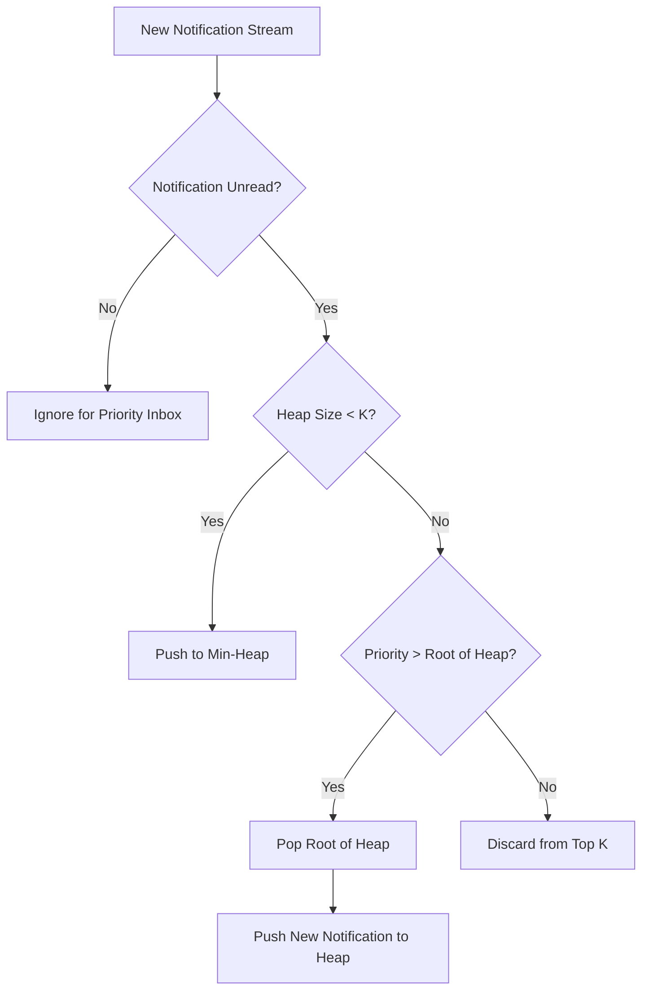

# Stage 1: Notification System Design

This document details the architecture and design of the **Priority Inbox** for the Campus Notifications Platform, resolving the challenge of notification overload for students.

## 1. Priority Scoring & Ranking Algorithm

Notifications are categorized into three types: **Placements**, **Results**, and **Events**. They are ranked based on a combination of **weight** and **recency**:

### Priority Criteria:
1. **Weight (Type):** Placements > Results > Events.
   - **Placement:** Weight = `3` (Critical career impact)
   - **Result:** Weight = `2` (Academic significance)
   - **Event:** Weight = `1` (General campus activities)
2. **Recency:** Newer notifications have higher priority than older ones.

### Sorting Algorithm:
To rank any two notifications $A$ and $B$:
- If $\text{Weight}(A) \neq \text{Weight}(B)$, the notification with the higher weight comes first.
- If $\text{Weight}(A) = \text{Weight}(B)$, the notification with the newer timestamp ($\text{Timestamp}(A) > \text{Timestamp}(B)$) comes first.

---

## 2. Maintaining the Top $K$ Notifications Efficiently

As new notifications stream in dynamically, maintaining the top $K$ (e.g., top 10, 15, 20) notifications in real-time is a challenge.

### Naive Approach (Sorting):
Whenever a new notification arrives, append it to a list of size $N$ and re-sort the entire list.
- **Time Complexity:** $O(N \log N)$ per update.
- **Problem:** Scales poorly as $N$ grows large.

### Optimized Approach (Min-Heap / Priority Queue):
We maintain a bounded **Min-Heap** (Priority Queue) of size $K$ where the priority is defined using the comparison rules above. In a Min-Heap, the root node always represents the **lowest priority** element currently in the top $K$.

#### Data Structure Operations:
1. **Initialization:** Add the first $K$ unread notifications to the heap. (Complexity: $O(K)$).
2. **Streaming Update:** When a new notification $E$ arrives:
   - Compare $E$ with the root (lowest priority notification in our top $K$).
   - If $E$ has higher priority than the root:
     - Pop the root (remove it from the top $K$).
     - Push $E$ into the heap.
     - Re-heapify.
   - If $E$ has lower priority than the root, it does not belong in the top $K$, so we ignore it.
- **Time Complexity:** $O(\log K)$ per incoming notification.
- **Space Complexity:** $O(K)$ auxiliary memory to store only the top $K$ items.

Since $K \ll N$ (e.g., $K = 10$, while $N$ could be thousands), $O(\log K)$ is effectively $O(1)$, making this approach highly scalable and suitable for production.

---

## 3. Data Flow Diagram

